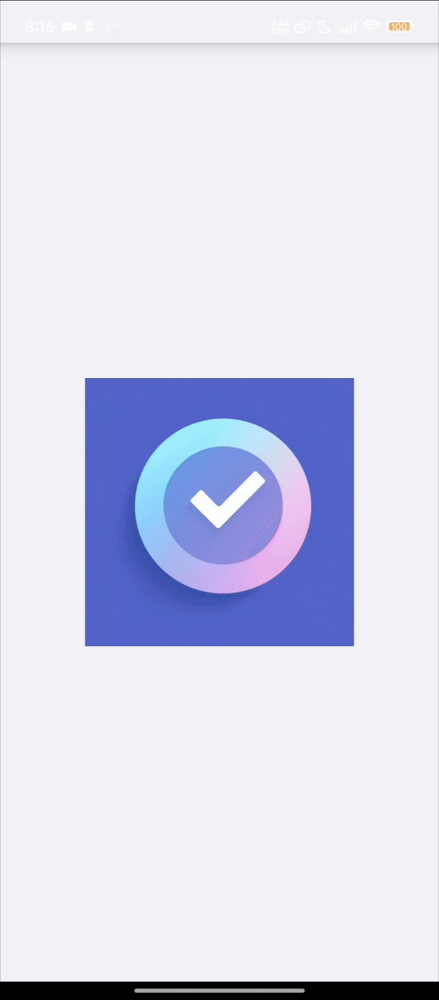

  
  <h1>✨ Simple Tasks ✨</h1>

  
  
  
  
  > 🌟 A sleek, iOS-inspired task management PWA with dark mode and smooth interactions

---

### 🚀 Key Features

| Feature Highlights |
|-------------------|
| 📱 **Responsive Design** - Works seamlessly across all devices |
| 🌙 **Dark Mode Interface** - Easy on the eyes |
| ✨ **iOS-style UI/UX** - Familiar and intuitive interface |
| 🔄 **Pull to Refresh** - Native-like interaction |
| 📋 **Task Filtering** - Sort by all, active, or completed |
| 🔍 **Search Tasks** - Quick task lookup |
| 💾 **Offline Capable** - Works without internet |
| 📲 **PWA Ready** - Install on any device |
| ⚡ **Haptic Feedback** - Enhanced interaction feedback |
| 👆 **Swipe to Delete** - Efficient task management |

### 📸 App in Action

### 💻 Tech Stack

### 📄 License

Released under the [Unlicense](LICENSE). This is free and unencumbered software released into the public domain.

  Built with ❤️ by rulercosta

